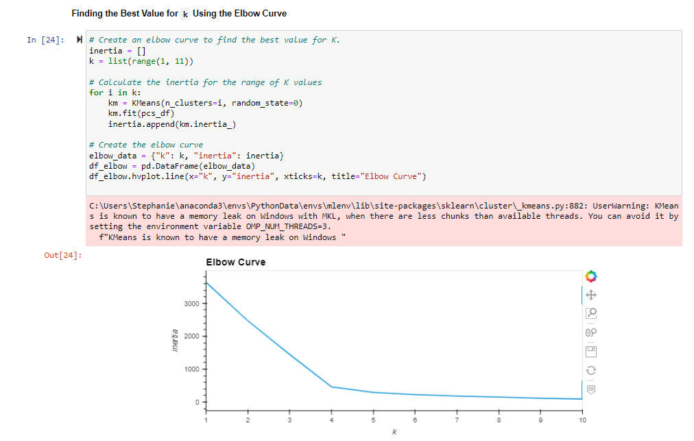
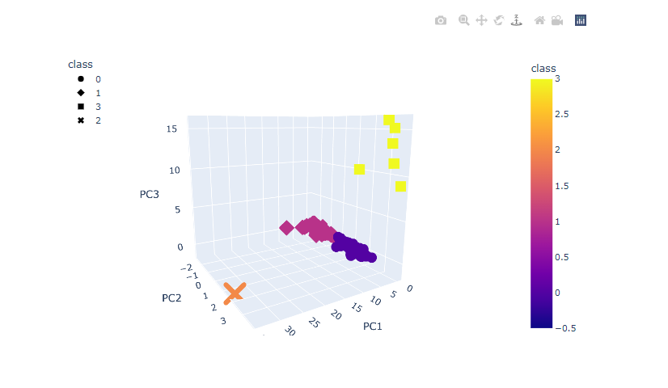
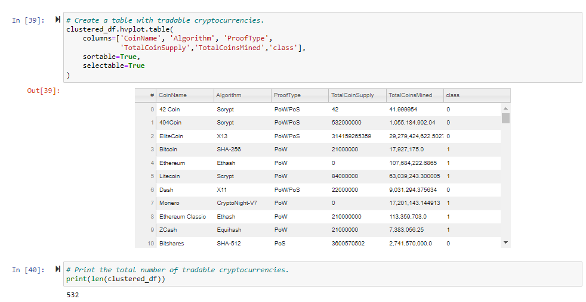
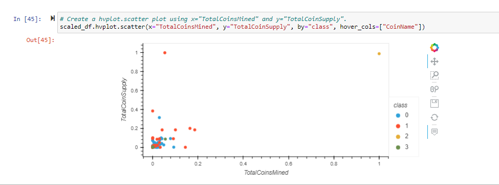

# Cryptocurrencies Analysis Overview

Utilizing unsupervised machine learning to group currently traded cryptocurrencies into different classification
systems. The data visualizations are show below, these visualizations are a reflection of the clustering algorithm. 
The aim is to provide an report to include a new cryptocurrency investment portfolio. 

